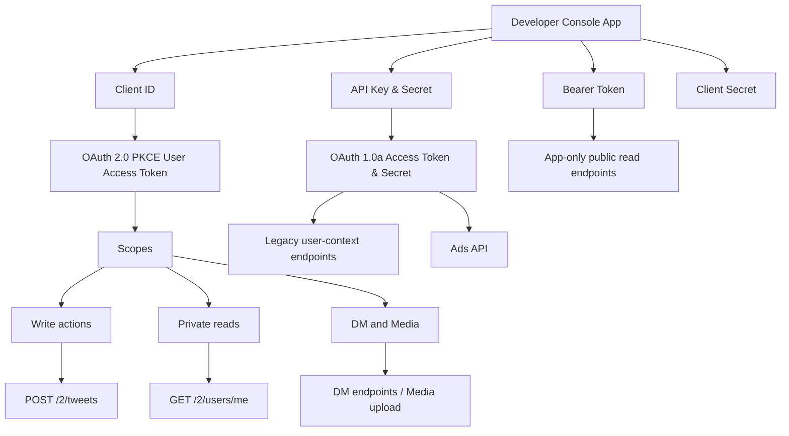

# อ่านเอกสาร X Developer Platform Overview และสรุปการใช้งานจริงสำหรับงานพัฒนา

## Executive summary

URL หลัก: `https://docs.x.com/overview` · `https://docs.x.com/x-api/overview` · `https://docs.x.com/x-api/getting-started/pricing`

หน้า `overview` ของ X เป็นหน้า landing page ที่บอกภาพรวมว่าแพลตฟอร์มถูกแบ่งเป็น **X API แบบ pay-per-use**, **X API แบบ Enterprise**, และ **X Ads API** โดยแกนกลางของระบบคือการเข้าถึงโพสต์ ผู้ใช้ เทรนด์ DM รายการ Spaces การสตรีมแบบเรียลไทม์ และความสามารถด้าน webhook/กิจกรรมแบบ push รวมถึงมี SDK ทางการสำหรับ Python และ TypeScript ให้ใช้เร็วขึ้น. สำหรับโปรเจกต์อย่าง **BN9 X Social Real V5 Mega** จุดตัดสินใจหลักไม่ใช่ “มี API ไหม” แต่คือ **จะใช้ token แบบไหน**, **ต้องขอ scope อะไร**, **จะอ่านข้อมูลอย่างเดียวหรือยิง action จริง**, และ **จะอยู่ใน pay-per-use ได้หรือจำเป็นต้องขอ Enterprise / Ads API เพิ่ม**. ข้อจำกัดสำคัญที่เอกสารย้ำคือ **App-only Bearer Token ใช้กับงานอ่านข้อมูลสาธารณะเป็นหลัก**, ส่วนงานที่ทำในนามผู้ใช้จริง เช่น โพสต์ ไลก์ ติดตาม DM อัปโหลดมีเดีย และ personalized trends ต้องใช้ **user-context authentication** และ scope ให้ตรง. ค่าใช้จ่ายฝั่ง X API v2 เป็นแบบเครดิตตามการใช้งานจริง, มีแนวคิด **Owned Reads** สำหรับอ่าน “ข้อมูลของตัวเอง” ที่ถูกลง, และบางฟีเจอร์ระดับสูง เช่น firehose, Powerstream, analytics at scale และ stream webhooks อยู่ฝั่ง Enterprise. citeturn42view0turn34view0turn34view1turn5view0turn35view1turn21view0turn21view6

อีกประเด็นที่ควรรู้ก่อนลง production คือเอกสารบางส่วนยังมีลักษณะ transitional หรือไม่สอดคล้องกันเล็กน้อย เช่น หน้า “About the X API” ยังบอกว่า v1.1 เหลือบาง media upload endpoints อยู่ แต่ docs ฝั่ง v2 มี media upload endpoints เปิดใช้งานแล้ว; และหน้า “X API Overview” จัด Account Activity กับ Stream Webhooks ไว้ฝั่ง Enterprise-only ขณะที่ quickstart ของ Account Activity บางหน้าระบุว่าใช้ได้กับ Enterprise และ Pay Per Use tiers. แปลเป็นภาษาคนทำงานจริงคือ **เช็ก entitlement ที่เห็นได้จริงใน Developer Console และสิทธิ์ที่เปิดให้ในแอปของคุณก่อนเสมอ** แล้วค่อยสรุป capability สุดท้ายของระบบ. citeturn34view1turn17view0turn17view1turn34view0turn32search14

## หน้า overview อธิบายอะไร และสรุปว่า X API ทำอะไรได้บ้าง

URL หลัก: `https://docs.x.com/overview` · `https://docs.x.com/x-api/overview` · `https://docs.x.com/x-api/getting-started/about-x-api` · `https://docs.x.com/x-api/fundamentals/data-dictionary`

ถ้าอ่านจากหน้า `overview` แบบตรงไปตรงมา หน้านี้ไม่ได้เป็นสเปกเชิงลึกของ endpoint ใด endpoint หนึ่ง แต่ทำหน้าที่เป็น **แผนที่รวมของแพลตฟอร์ม**: บอกว่ามีสินค้าอะไรบ้าง, เริ่มต้นตรงไหน, ไปดู pricing ตรงไหน, ไปกด API reference ตรงไหน, มี SDK อะไร และมี X Ads API แยกออกไปอย่างไร. เมื่อไล่ต่อเข้า `x-api/overview` และ `about-x-api` จะเห็นภาพว่าฝั่ง X API v2 ครอบคลุมหมวดใหญ่ ๆ ได้แก่ Posts, Users, Direct Messages, Spaces, Lists, Likes, Trends, Media, Communities, Community Notes, News, Usage, Compliance, Stream Connections, X Activity และ Webhooks; ฝั่ง v2 ยังเน้น `fields` และ `expansions` เพื่อดึงเฉพาะข้อมูลที่ต้องใช้จริง, รองรับ edit history, conversation tracking, annotations และ response แบบ JSON ที่ทันสมัยกว่า v1.1. citeturn42view0turn34view0turn34view1turn8search2

สำหรับการใช้งานจริง ความสามารถหลักที่หน้า overview พยายามขายมีอยู่ 4 แกน: **อ่านข้อมูล** เช่น lookup, search, trends, stream; **ทำ action** เช่น create post, like, follow, DM, bookmark, lists; **ทำงานแบบ real-time** ผ่าน filtered stream, X Activity, webhooks และบริการ Enterprise; และ **จัดการต้นทุน/การเข้าถึง** ผ่าน Developer Console, credits, usage monitoring และ pricing แบบ pay-per-use. หน้า overview ยังเชื่อมไปยัง tutorials, tools, libraries, developer forum และ agent resources ซึ่งแปลว่า docs ปัจจุบันไม่ได้ออกแบบมาแค่ให้ “ค้น endpoint” แต่ตั้งใจให้เป็นทั้ง reference, quickstart และ operational guide ในที่เดียว. citeturn42view0turn34view0turn11view1

ตารางนี้สรุปหมวดความสามารถที่เห็นชัดจาก `overview` และ `x-api/overview`. citeturn42view0turn34view0turn34view1

| หมวด | ทำอะไรได้บ้าง | ใช้กับงานแบบไหน |
|---|---|---|
| Posts | ค้นหา ดูรายละเอียด สร้าง ลบ ซ่อน reply ดู timelines และ quote/repost | social listening, publish, moderation |
| Users | lookup โปรไฟล์ ค้นผู้ใช้ จัดการ follow/block/mute | CRM, onboarding, account actions |
| Direct Messages | อ่านและส่ง DM | support bot, private workflow |
| Spaces | ดู Spaces และโพสต์ใน Space | event tracking, live context |
| Lists | สร้าง/ดู/จัดการ Lists และ pinned Lists | curated feeds, monitoring sets |
| Trends | trends ตาม location และ personalized trends | trend monitoring, content planning |
| Media | upload รูป/GIF/วิดีโอ/subtitles และ metadata | rich posts, DM attachments |
| Streaming & Events | filtered stream, X Activity, webhooks, account activity | real-time pipeline |
| Ads API | campaign, audiences, creatives, analytics | performance marketing |

ถ้ามองแบบ “เอาไปทำระบบได้เลย” ให้จำง่าย ๆ ว่า **งานอ่านสาธารณะ + analytics เบื้องต้น = X API ปกติ**, **งานยิง action จริงในนาม user = user auth + scopes**, **งาน real-time scale สูง = stream/webhook/enterprise**, และ **งานยิงแคมเปญโฆษณา = Ads API แยกต่างหาก**. citeturn34view0turn25view0turn25view4

## Token ประเภทต่าง ๆ สิทธิ์ และการยืนยันตัวตนที่ต้องเลือกให้ถูก

URL หลัก: `https://docs.x.com/x-api/getting-started/getting-access` · `https://docs.x.com/fundamentals/developer-apps` · `https://docs.x.com/fundamentals/authentication/overview` · `https://docs.x.com/fundamentals/authentication/oauth-2-0/authorization-code` · `https://docs.x.com/fundamentals/authentication/oauth-2-0/application-only` · `https://docs.x.com/fundamentals/authentication/oauth-1-0a/obtaining-user-access-tokens`

แกนของเอกสาร auth ฝั่ง X คือ “คิดจาก **context** ก่อน แล้วค่อยเลือก token.” ถ้าระบบของคุณทำแค่อ่านข้อมูลสาธารณะ ให้ใช้ **Bearer Token แบบ app-only**. ถ้าระบบต้องทำอะไรในนามผู้ใช้คนหนึ่งจริง ๆ เช่นโพสต์ ไลก์ ติดตาม อ่าน/ส่ง DM หรืออัปโหลดมีเดีย ให้ใช้ **OAuth 2.0 Authorization Code Flow with PKCE** ซึ่งเป็นวิธีที่ docs แนะนำสำหรับโปรเจกต์ใหม่ เพราะขอ scope แบบละเอียดได้. ถ้ายังต้องรองรับระบบเก่า งานบางประเภท หรือ Ads API ให้ใช้ **OAuth 1.0a User Context** ซึ่งอาศัย API Key/Secret + Access Token/Secret. citeturn35view0turn10view0turn10view1turn5view1turn9view0turn36view1turn37view0

ตารางนี้รวบ token/credential ที่ docs ใช้จริง และแปลเป็นภาษาตัดสินใจสำหรับงานพัฒนา. citeturn35view0turn10view0turn10view6turn36view1turn9view0turn37view0turn25view3

| ประเภท | ได้มาจากอะไร | ทำงานในนามใคร | เหมาะกับอะไร | ข้อจำกัดสำคัญ |
|---|---|---|---|---|
| Bearer Token แบบ App-only | Developer Console หรือ `POST oauth2/token` | แอป | อ่านข้อมูลสาธารณะ, search, lookup, trends, filtered stream | ไม่มี current user, ใช้กับ write/DM ไม่ได้, ใช้ rate limit แบบ per-app |
| OAuth 2.0 User Access Token | PKCE flow ผ่าน Client ID, authorize URL, auth code, token exchange | ผู้ใช้ที่ authorize แอป | โพสต์, ไลก์, follow, bookmark, DM, media upload, personalized trends | ต้องขอ scopes ให้ตรง, access token ปกติอยู่ได้ 2 ชั่วโมง, refresh token จะได้เมื่อขอ `offline.access` |
| OAuth 1.0a Access Token & Secret | app credentials + access tokens ของแอป/ผู้ใช้ หรือ 3-legged OAuth | ผู้ใช้ | legacy flows, own automation, บางงาน user-context และ Ads API | ไม่มี fine-grained scopes แบบ OAuth2, ใช้ permission levels ของแอปแทน, token ไม่หมดอายุเองแต่ผู้ใช้ revoke ได้ |

แผนผังนี้สรุปความสัมพันธ์ของ **แอป → credential → token → endpoint class** ตาม docs อย่างย่อ. citeturn10view0turn10view6turn35view0turn36view1turn9view0turn37view0



ฝั่ง OAuth 2.0 PKCE มีจุดที่ต้องจำ 4 อย่าง: access token ปกติอยู่ได้ **2 ชั่วโมง**, ถ้าต้องการ refresh token ต้องขอ `offline.access`, callback URL ต้อง **exact match**, และถ้าเป็น public client เช่น native app / SPA จะใช้ PKCE โดยไม่พึ่ง client secret ส่วน confidential client เช่น web app / bot server-side จะมี client secret ให้ใช้เพิ่ม. Docs ยังระบุว่า callback URLs ในแอปมีได้สูงสุด **10 URL**, local dev ควรใช้ `http://127.0.0.1` ไม่ใช่ `localhost`, และเปลี่ยน permission แล้วผู้ใช้เดิมต้อง authorize ใหม่เพื่อได้ token/สิทธิ์ชุดใหม่. citeturn9view0turn10view6turn10view7turn10view8turn10view5

หน้า PKCE ระบุ scopes ที่ใช้ได้ดังนี้; สำหรับคนทำระบบ ให้แปลว่า “scope = สวิตช์เปิดความสามารถ” ถ้าไม่ขอ scope นั้น endpoint ที่เกี่ยวข้องจะเรียกไม่ได้แม้ token จะถูกต้อง. citeturn9view0

| Scope | สิทธิ์ที่ได้ |
|---|---|
| `tweet.read` | อ่านโพสต์ที่ผู้ใช้นั้นมีสิทธิ์เห็น |
| `tweet.write` | โพสต์และ repost ในนามผู้ใช้ |
| `tweet.moderate.write` | ซ่อน/เลิกซ่อน replies ของโพสต์ตัวเอง |
| `users.read` | อ่านข้อมูลบัญชีที่มีสิทธิ์เห็น |
| `users.email` | ดึงอีเมลของผู้ใช้ที่ authenticate |
| `follows.read` | อ่าน following/followers |
| `follows.write` | follow / unfollow |
| `like.read` | อ่าน likes |
| `like.write` | like / unlike |
| `list.read` | อ่าน lists และความสัมพันธ์กับ lists |
| `list.write` | สร้าง/จัดการ lists |
| `bookmark.read` | อ่าน bookmarks |
| `bookmark.write` | เพิ่ม/ลบ bookmarks |
| `block.read` | อ่านบัญชีที่ block |
| `block.write` | block / unblock |
| `mute.read` | อ่านบัญชีที่ mute |
| `mute.write` | mute / unmute |
| `space.read` | อ่าน Spaces |
| `dm.read` | อ่าน Direct Messages |
| `dm.write` | ส่ง/จัดการ Direct Messages |
| `media.write` | อัปโหลดมีเดีย |
| `offline.access` | ขอ refresh token เพื่อใช้งานต่อโดยไม่ให้ user login ใหม่ |

จุดสับสนที่พบบ่อยคือคำว่า **“Bearer Token”**. ใน docs ของ X คำนี้มักใช้เรียก **App-only Bearer Token** ที่ได้จาก console หรือ `oauth2/token` ฝั่ง app-only; แต่ใน OAuth 2.0 user-context นั้น access token ของผู้ใช้ก็ถูกส่งใน header แบบ `Authorization: Bearer ...` เหมือนกัน. ดังนั้นเวลาคุยในทีม ควรตั้งชื่อให้ชัดเป็น **APP_BEARER_TOKEN** กับ **USER_ACCESS_TOKEN** เพื่อไม่ให้สลับกันตอนยิง action จริง. citeturn35view0turn36view3turn40view0turn40view1turn40view2

## Endpoints สำคัญ พร้อมตัวอย่างงานอ่านข้อมูลและงานเขียน action

URL หลัก: `https://docs.x.com/x-api/overview` · `https://docs.x.com/make-your-first-request` · `https://docs.x.com/x-api/posts/create-post` · `https://docs.x.com/x-api/direct-messages/get-dm-events` · `https://docs.x.com/x-api/direct-messages/create-dm-message-by-participant-id` · `https://docs.x.com/x-api/trends/trends-by-woeid/introduction` · `https://docs.x.com/x-api/trends/personalized-trends/introduction`

สำหรับงานจริง ผมแนะนำให้คิด endpoint เป็น 3 ชั้น: **read public**, **read private/user-owned**, และ **write actions**. ถ้าขึ้นต้นด้วย lookup/search/trends/filtered stream ส่วนใหญ่ Bearer app-only พอ; ถ้าเป็น post/like/follow/bookmark/DM/media ให้คิดเป็น user token ก่อนเลย; ถ้าเป็น Ads ให้แยก mental model ไปอีกกองหนึ่ง. ตารางนี้เลือก endpoint ที่ใช้งานจริงบ่อยที่สุดและเชื่อมกับ capability ที่ user ขอไว้. citeturn34view0turn29view0turn40view0turn40view1turn40view2turn39view3turn39view4turn17view0turn17view3turn17view4turn33search2

| Endpoint สำคัญ | ใช้ทำอะไร | auth ที่เหมาะ | หมายเหตุใช้งาน |
|---|---|---|---|
| `GET /2/users/by/username/:username` | หา user จาก username | App-only หรือ user-context | จุดเริ่มต้นที่ง่ายสุดสำหรับ test API |
| `GET /2/tweets/search/recent` | ค้นโพสต์ย้อนหลัง 7 วัน | App-only หรือ user-context | เหมาะกับ social listening |
| `GET /2/tweets/search/stream` + `/rules` | รับโพสต์แบบ near real-time ตามกฎ | App-only | ใช้ persistent connection |
| `POST /2/tweets` | สร้างหรือแก้ไขโพสต์ | User token | ใช้กับโพสต์จริงในนามผู้ใช้ |
| `GET /2/users/:id/tweets` | timeline ของ user | App-only หรือ user-context | ถ้าเป็นข้อมูล “ของตัวเอง” อาจเข้า Owned Reads |
| `POST /2/users/:id/likes` | like / unlike | User token | scope `like.write` |
| `POST /2/users/:id/following` | follow / unfollow | User token | scope `follows.write` |
| `GET /2/dm_events` | อ่าน DM events | User token | scope `dm.read` |
| `POST /2/dm_conversations/with/{participant_id}/messages` | ส่ง DM | User token | scope `dm.write` |
| `GET /2/trends/by/woeid/:id` | trend ตาม location | App-only | ใช้ WOEID |
| `GET /2/users/personalized_trends` | trend เฉพาะผู้ใช้ | User token | ต้องใช้ OAuth 2.0 PKCE และ Premium User Subscription |
| `POST /2/media/upload` / `initialize` / `finalize` / `status` | อัปโหลดมีเดีย | User token | รูปใช้ simple ได้, วิดีโอ/ไฟล์ใหญ่ใช้ chunked |
| `POST /2/webhooks` | ลงทะเบียน webhook | App-only Bearer | เป็น infra สำหรับ XAA/AAA/filtered stream webhooks |
| `GET https://ads-api.x.com/...` | งานโฆษณา | OAuth 1.0a user token | ต้องขอ Ads API access แยกต่อแอป |

**ตัวอย่าง read action ที่ docs ใช้เป็น quickstart** คือ lookup ชื่อผู้ใช้ด้วย app-only Bearer Token. แปลไทยแบบใช้งานจริงคือ “เช็กว่าคีย์ใช้ได้ไหม และระบบออก internet/API gateway ถูกไหม” ก่อนทำอย่างอื่น. citeturn29view0turn35view3turn36view1

```bash
# อ่านข้อมูลสาธารณะด้วย Bearer Token แบบ app-only
curl "https://api.x.com/2/users/by/username/xdevelopers" \
  -H "Authorization: Bearer $BEARER_TOKEN"
```

**ตัวอย่าง write action ที่ต้องใช้ user-context** คือสร้างโพสต์ด้วย `POST /2/tweets`. หน้า endpoint ระบุชัดว่า endpoint นี้รับ OAuth2UserToken / UserToken, รองรับการแก้โพสต์, มีฟิลด์อย่าง `made_with_ai` และ `paid_partnership`, และมีข้อจำกัดที่น่าจำคือการใช้ `quote_tweet_id` ต้องมี Enterprise plan ไม่ได้เปิดใน self-serve pay-per-use tiers. citeturn40view0

```bash
# โพสต์ในนามผู้ใช้ด้วย OAuth 2.0 user access token
curl -X POST "https://api.x.com/2/tweets" \
  -H "Authorization: Bearer $USER_ACCESS_TOKEN" \
  -H "Content-Type: application/json" \
  -d '{
    "text": "สวัสดีจากระบบของผม"
  }'
```

ถ้าระบบของคุณต้องทำ **DM support** เอกสารฝั่ง v2 ครอบคลุมทั้งอ่าน DM (`GET /2/dm_events`) และส่ง DM (`POST /2/dm_conversations.../messages`) และ endpoint ส่ง DM รองรับ attachment ที่อ้างด้วย `media_id`. ส่วน personalized trends เป็นกรณีพิเศษ: docs ระบุว่าต้องมี **OAuth 2.0 PKCE user tokens** และ **Premium User Subscription** จึงจะเรียกได้ ต่างจาก trends by WOEID ที่ใช้ bearer ฝั่งแอปได้. citeturn40view1turn40view2turn39view4turn39view3

ถ้าคุณจะเขียนโค้ดจริงแทน cURL, docs ของ XDK แสดงตัวอย่างทั้ง Python และ TypeScript โดยตัว SDK ช่วยเรื่อง auth, pagination และ streaming ให้. ฝั่ง Python quickstart ใช้ `Client(bearer_token="...")` แล้ว iterate ผลจาก `search_recent`; ฝั่ง TypeScript ใช้ `new Client({ bearerToken })` แล้วเรียก `client.users.getByUsername(...)`. สำหรับทีมที่ยังไม่แข็งเรื่อง signing/auth เอง ผมมองว่า XDK หรือ Postman เป็นจุดเริ่มต้นที่คุ้มเวลากว่าเขียน raw requests ตั้งแต่วันแรก. citeturn29view1turn29view2turn29view3turn24search8turn28search4turn28search6

## ราคา เครดิต Rate limits และข้อจำกัดที่ต้องรู้ก่อนทำระบบจริง

URL หลัก: `https://docs.x.com/x-api/getting-started/pricing` · `https://docs.x.com/fundamentals/rate-limits` · `https://docs.x.com/x-api/fundamentals/rate-limits` · `https://docs.x.com/developer-guidelines`

โมเดลคิดเงินของ X API v2 ตอนนี้คือ **pay-per-usage แบบใช้เครดิตล่วงหน้า** ไม่ใช่ subscription รายเดือน: ซื้อเครดิตไว้ก่อนใน Developer Console, ระบบหักเครดิตตามการอ่าน/เขียนจริง, ดู usage และต้นทุนได้แบบ real-time, ตั้ง auto-recharge และ spending limit ได้, และถ้าเครดิตติดลบหรือหมด requests จะถูก block จนกว่าจะเติม. หน้า pricing ยังระบุด้วยว่าราคาปัจจุบันขึ้นกับ endpoint group และ “ราคาอาจเปลี่ยนได้” โดยให้ยึด Developer Console เป็นแหล่งจริงของอัตราปัจจุบัน. citeturn5view0turn11view1turn12view4turn12view2

ตารางนี้สรุป “ราคาตามชนิด resource/action” ที่ docs เปิดเผยบนหน้า pricing. citeturn12view5turn12view6

| กลุ่มการใช้งาน | ราคา |
|---|---|
| อ่าน Posts | `$0.005` ต่อ resource |
| อ่าน Users | `$0.010` ต่อ resource |
| อ่าน DM Events | `$0.010` ต่อ resource |
| อ่าน Following/Followers | `$0.010` ต่อ resource |
| อ่าน Lists / Spaces / Communities / Media / Analytics | ส่วนใหญ่ `$0.005` ต่อ resource |
| อ่าน Trends | `$0.010` ต่อ resource |
| สร้าง content | `$0.015` ต่อ request |
| สร้าง content ที่มี URL | `$0.200` ต่อ request |
| สร้าง DM interaction / user interaction | `$0.015` ต่อ request |
| ลบ interaction | `$0.010` ต่อ request |
| Bookmark / Media metadata / List manage บางประเภท | เริ่มที่ `$0.005` ต่อ request |
| Owned Reads | `$0.001` ต่อ resource |

**Owned Reads** เป็นจุดที่คุ้มมากถ้าระบบของคุณทำ dashboard หรือ account-management ของ “เจ้าของแอปเอง” เพราะ docs ระบุว่า requests อย่างโพสต์ของตัวเอง mentions ของตัวเอง likes/bookmarks/followers/following/lists ของตัวเอง จะคิดเพียง **$0.001 ต่อ resource** เมื่อ `{id}` ตรงกับ authenticated user และผู้ใช้นั้นเป็นเจ้าของ developer app; อีกทั้งมี deduplication ภายในหน้าต่างเวลา 24 ชั่วโมงแบบ UTC day window ซึ่งโดยทั่วไปจะไม่คิดซ้ำเมื่อดึง resource เดิมซ้ำในวันเดียวกัน แม้ docs จะระบุว่าเป็น soft guarantee และอาจมี edge case ได้. citeturn12view3turn12view4

เรื่อง rate limits ให้จำ schema ให้ง่ายที่สุด: **ทุก endpoint มีลิมิตของตัวเอง**, app-only ใช้ลิมิตแบบ **per-app**, user-context ใช้ลิมิตแบบ **per-user**, และทุก response จะมี `x-rate-limit-limit`, `x-rate-limit-remaining`, `x-rate-limit-reset`. ถ้าชนลิมิตจะได้ `429 Too Many Requests`; docs แนะนำให้ cache, ใช้ exponential backoff, เฝ้าดู headers, และถ้าจะเอาข้อมูล real-time อย่า polling search ถี่ ๆ ให้ย้ายไป stream แทน. citeturn38view0

ตารางนี้เลือก rate limits ของ endpoint groups ที่เจอบ่อยเวลาทำระบบ monitor + action. citeturn14view0turn14view2turn13view2turn13view1turn15view0turn13view8turn13view10turn13view11turn14view3turn13view9

| กลุ่ม endpoint | ลิมิตที่เห็นใน docs |
|---|---|
| User lookup `GET /2/users`, `/2/users/:id`, `/2/users/by/username/:username` | `300/15min` ต่อ app, `900/15min` ต่อ user |
| Recent search `GET /2/tweets/search/recent` | `450/15min` ต่อ app, `300/15min` ต่อ user; query length `512` |
| Full-archive search `GET /2/tweets/search/all` | `1/sec` และ `300/15min` ต่อ app, `1/sec` ต่อ user; query length `1024` |
| User timeline `GET /2/users/:id/tweets` | `10,000/15min` ต่อ app, `900/15min` ต่อ user |
| Mentions `GET /2/users/:id/mentions` | `450/15min` ต่อ app, `300/15min` ต่อ user |
| Filtered stream connect `GET /2/tweets/search/stream` | `50/15min`; 1 connection; 1000 rules; rule length 1024; 250 posts/sec |
| Manage posts `POST /2/tweets` | `10,000/24hrs` ต่อ app, `100/15min` ต่อ user |
| Follow / unfollow | `50/15min` ต่อ user |
| Retweet / unretweet | `50/15min` ต่อ user |
| Like / unlike | `50/15min` และ `1,000/24hrs` ต่อ user |
| อ่าน DM | `15/15min` ต่อ user |
| ส่ง DM | `15/15min` และ `1,440/24hrs` ต่อ user; `1,440/24hrs` ต่อ app |
| อ่าน bookmarks | `180/15min` ต่อ user |
| Spaces lookup | `300/15min` ต่อ app และ user |
| Usage endpoint `GET /2/usage/tweets` | `50/15min` ต่อ app |

ข้อจำกัดและ policy ที่มีผลกับระบบ automation จริงมีมากกว่าลิมิตตัวเลข. หน้า Developer Guidelines ระบุชัดว่า **ห้าม scrape / browser automation**, **ห้ามสร้างหลายแอปเพื่อเลี่ยง limits**, **ห้าม train AI/ML models ด้วย X data** ยกเว้น Grok, **ต้องลบ content ภายใน 24 ชั่วโมง** เมื่อ X หรือผู้ใช้ร้องขอ/ลบ/suspend, มีเพดาน redistribution ของ Post IDs และ hydrated content, และบัญชีอัตโนมัติต้องติดป้าย automated + เปิดทาง opt-out. งาน commercial บางแบบต้องอยู่บน paid tier ที่เหมาะสม และบาง use case เช่น government use ถูกระบุว่าต้อง Enterprise. citeturn26view0

สิ่งที่เอกสาร **ไม่ระบุ** หรือ **ไม่ชัดเจนพอ** สำหรับการวางแผนต้นทุน/สิทธิ์ คือ **ราคา Enterprise แบบสาธารณะ**, **ราคาของ Ads API**, และบาง entitlement ที่ขึ้นกับสถานะบัญชีจริงใน Developer Console มากกว่าหน้า docs. นอกจากนี้ docs เฉพาะบางหน้ามีข้อความที่ยังไม่สอดคล้องกันเรื่อง Account Activity และ legacy/v2 media upload ดังนั้นในการประเมิน production readiness ให้ยึดลำดับนี้: **Console entitlement > endpoint auth page > current pricing page > overview page**. citeturn42view0turn34view0turn34view1turn25view0turn25view1turn32search14

## Streaming Webhooks Media upload และ Ads API สัมพันธ์กับ API หลักอย่างไร

URL หลัก: `https://docs.x.com/x-api/posts/filtered-stream/introduction` · `https://docs.x.com/x-api/webhooks/introduction` · `https://docs.x.com/x-api/webhooks/quickstart` · `https://docs.x.com/x-api/account-activity/introduction` · `https://docs.x.com/x-api/activity/introduction` · `https://docs.x.com/x-api/media/introduction` · `https://docs.x.com/x-ads-api/introduction`

ถ้าสรุปแบบปฏิบัติการ: ฝั่ง real-time ของ X มี 4 ชั้นหลัก. ชั้นแรกคือ **Filtered Stream** สำหรับโพสต์สาธารณะที่ match rules ของคุณและรับผ่าน persistent HTTP connection; docs ระบุ latency ที่ประมาณ **6–7 วินาทีใน P99**, ปรับกฎได้โดยไม่ต้องตัด connection, และถ้าต้อง latency ต่ำกว่านี้ให้ดู **Powerstream** ฝั่ง Enterprise. ชั้นที่สองคือ **V2 Webhooks API** ซึ่งเป็น infra สำหรับ webhook registration, CRC, signature verification และเชื่อมไปยังผลิตภัณฑ์ที่รองรับ webhooks. ชั้นที่สามคือ **X Activity API (XAA)** ที่ส่ง activity events เช่น profile updates, follow events, spaces/chat/news events โดยรองรับทั้ง persistent stream และ webhook และ docs ย้ำว่า **XAA ไม่ได้ส่งโพสต์**; ถ้าต้องการโพสต์ real-time ให้ใช้ filtered stream. ชั้นที่สี่คือ **Account Activity API (AAA)** ที่ subscribe activity ของบัญชีผู้ใช้เฉพาะรายและส่ง events อย่าง posts, DMs, likes, follows, blocks ผ่าน webhooks หลังจากคุณ register webhook และ subscribe ผู้ใช้เข้ากับ webhook นั้น. citeturn21view0turn21view2turn21view3turn21view4turn32search3turn21view5

ด้าน webhook เอง docs ชัดมากเรื่อง operational requirements: URL ต้องเป็น **public HTTPS**, **ห้ามมี port** ใน callback URL สำหรับ webhook, endpoint ต้องตอบได้ทั้ง **GET สำหรับ CRC** และ **POST สำหรับ event delivery**, ต้องสร้าง `response_token` จาก `crc_token` ตอน CRC และต้องตรวจ `x-twitter-webhooks-signature` ด้วย HMAC SHA-256 เพื่อยืนยันว่า request มาจาก X จริง. จุดที่คนทำระบบพลาดบ่อยคือเรื่อง duplicate events: docs เตือนตรง ๆ ว่า webhook อาจส่ง event ซ้ำได้ และ webhook app ควร deduplicate ด้วย event ID. อีกจุดที่ควรรู้คือ **webhook management endpoints ใช้ OAuth2 App-Only Bearer Token** ไม่ใช่ user token. citeturn21view3turn22view1turn22view3turn22view4

เรื่อง **media upload** ตอนนี้ v2 docs ครบพอสำหรับใช้งานจริงแล้ว. งานอัปโหลดรูปธรรมดาใช้ `POST /2/media/upload` ได้ โดย endpoint ระบุ authorizations เป็น `OAuth2UserToken / UserToken` และ media categories ที่เห็นชัดใน simple upload คือ `tweet_image`, `dm_image`, `subtitles`. ถ้าเป็นวิดีโอ GIF หรือไฟล์ใหญ่ ให้ใช้ workflow แบบ chunked: **INIT → APPEND → FINALIZE → STATUS → เอา `media_id` ไปแนบใน `POST /2/tweets` หรือ DM endpoint**. Docs ระบุว่า image ควรไม่เกิน **5 MB**, animated GIF ไม่เกิน **15 MB**, และ endpoint initialize รับ `total_bytes` ได้สูงสุด **17179869184 bytes**; media categories ฝั่ง chunked มี `tweet_video`, `tweet_gif`, `amplify_video`, `dm_video`, `dm_gif` เป็นต้น. และเพราะ scope list ระบุ `media.write` แยกต่างหาก จึงควรขอ scope นี้ชัด ๆ หากระบบจะอัปโหลดมีเดียแน่นอน. citeturn18view0turn18view2turn19view1turn19view2turn19view3turn19view4turn17view2turn17view3turn17view4turn9view0

ฝั่ง **Ads API** ให้มองว่าเป็น “แพลตฟอร์มคู่ขนาน” มากกว่าจะเป็น extension ตรง ๆ ของ X API ทั่วไป. Docs ระบุว่า Ads API ใช้สำหรับ campaign management, custom audiences, creatives และ advertising analytics; การเข้าถึงต้อง **ยื่นขอ Ads API access แยกต่อแอป** หลังจากมี developer account/app แล้ว, ใช้งานผ่านโดเมน **`ads-api.x.com`**, และอาศัย **OAuth 1.0a access tokens** ไม่ใช่ OAuth2 PKCE เหมือน v2 user-context ทั่วไป. หน้า authenticated requests ยังบอกว่ามาตรฐาน X API และ Ads API **ใช้ client app เดียวกันร่วมกันได้**, แต่ Ads API มี model ของตัวเองเพิ่ม เช่น advertiser account, promotable users, app-level access (เช่น Conversion Only / Standard Access) และ ad-account-level permissions. ดังนั้นถ้าระบบ BN9 ต้อง “โพสต์ปกติ + ยิง campaign โฆษณา” คุณจะได้สถาปัตยกรรมสองขา: ขาแรก X API v2 สำหรับ organic/social actions, ขาที่สอง Ads API สำหรับ ad operations. citeturn25view0turn25view1turn25view3turn25view4

ฝั่ง Enterprise คือจุดที่ X ขยับจาก “API ใช้ทีละ endpoint” ไปสู่ “data/stream infrastructure.” Overview และ Enterprise intro ระบุฟีเจอร์อย่าง firehose/volume streams, likes streams, Powerstream, engagement metrics at scale, account activity, stream webhooks และ custom rate limits/dedicated support. สำหรับระบบ monitor ใหญ่ ๆ ที่เกิน rule limit, ต้องการ throughput สูง, ต้องการ webhook delivery ของ stream, หรือไม่อยากรับภาระ persistent streaming connection เอง ฝั่ง Enterprise จะตอบโจทย์กว่า pay-per-use ธรรมดา. citeturn42view0turn21view6turn41search0turn23view0

## Checklist ตั้งค่าเริ่มต้นสำหรับ BN9 X Social Real V5 Mega และคำค้นหาไว้หาแชทเก่าให้เร็ว

URL หลัก: `https://docs.x.com/x-api/getting-started/getting-access` · `https://docs.x.com/fundamentals/developer-apps` · `https://docs.x.com/fundamentals/developer-portal` · `https://docs.x.com/fundamentals/authentication/oauth-2-0/authorization-code` · `https://docs.x.com/fundamentals/rate-limits` · `https://docs.x.com/developer-guidelines`

ถ้าจะเริ่มโปรเจกต์ BN9 ให้เดินตาม checklist นี้จะลดงานแก้ย้อนทีหลังเยอะที่สุด เพราะมันผูกกับสิ่งที่ docs ย้ำซ้ำหลายหน้า: แยก environment, ขอ scopes เท่าที่จำเป็น, ตั้ง callback ให้ถูก, วาง monitoring ของ credits/rate limits ตั้งแต่แรก, และห้ามดีไซน์ระบบแบบหลบ policy. citeturn35view0turn10view9turn10view7turn11view1turn38view0turn26view0

- [ ] สร้าง developer account และยอมรับ Developer Agreement ให้เรียบร้อยใน `console.x.com`, จากนั้นสร้าง **แอปแยก dev / staging / production** ไม่ใช้แอปเดียวจบทุก environment. citeturn35view0turn10view9
- [ ] ตอนสร้างแอป ให้บันทึก `API Key`, `API Secret`, `Bearer Token`, `Client ID`, `Client Secret` และ `Access Token & Secret` ทันที เพราะ docs ระบุว่า credentials จะแสดง **ครั้งเดียว** และถ้าหายต้อง regenerate ซึ่งจะทำให้ของเดิมใช้ไม่ได้. citeturn35view0turn11view1
- [ ] ตัดสินใจตั้งแต่วันแรกว่า BN9 จะเป็นแค่ **reader/monitor** หรือจะเป็น **actor** ด้วย: ถ้า monitor อย่างเดียวให้เริ่มด้วย **APP_BEARER_TOKEN**; ถ้าจะโพสต์ ไลก์ follow bookmark DM media ให้ทำ **OAuth 2.0 PKCE** และเก็บ **USER_ACCESS_TOKEN** แยก. citeturn35view1turn36view1turn9view0
- [ ] ขอ scopes เฉพาะที่ต้องใช้จริง เช่น `tweet.read users.read` สำหรับอ่าน, เพิ่ม `tweet.write` ถ้าจะโพสต์, เพิ่ม `dm.read dm.write` ถ้าจะทำ DM, เพิ่ม `media.write` ถ้าจะอัปโหลดรูป/วิดีโอ, เพิ่ม `offline.access` ถ้าต้องต่ออายุ session อัตโนมัติ. citeturn9view0
- [ ] ตั้ง callback URLs ในแอปให้ **exact match**, local dev ใช้ `http://127.0.0.1/...` ไม่ใช้ `localhost`, และจำไว้ว่า 1 แอปมี callback URLs ได้สูงสุด 10 รายการ. citeturn10view7
- [ ] ถ้ามี webhook ให้เตรียม endpoint ที่เป็น **public HTTPS**, ไม่มี port ใน URL, ตอบ CRC ได้, verify signature ได้, และรองรับ duplicate events ด้วยการ dedupe event ID. citeturn21view3turn22view3turn22view4
- [ ] ถ้าจะโพสต์รูปหรือวิดีโอ ให้ทดสอบ media flow แยกจาก post flow ก่อน: **upload ให้ผ่าน → ได้ `media_id` → ค่อยแนบเข้า `POST /2/tweets` หรือ DM**. อย่าผูกสองขั้นตอนเข้าด้วยกันตั้งแต่รอบแรกเพราะ debug ยาก. citeturn19view1turn19view4
- [ ] ตั้ง observability ตั้งแต่วันแรก: log `x-rate-limit-*`, แยก metric ต่อ endpoint, และเรียก `GET /2/usage/tweets` เป็นระยะเพื่อดู consumption โดยไม่ต้องเดา. citeturn38view0turn12view2turn14view3
- [ ] ตั้ง spending limit และ auto-recharge ถ้าระบบต้องรันต่อเนื่อง เพราะเครดิตหมดแล้ว request จะถูก block. ถ้าระบบยังอยู่ช่วงทดสอบ ให้ตั้งเพดานต่ำ ๆ กัน surprise bill. citeturn12view4turn12view2
- [ ] ถ้า BN9 เน้น dashboard ของ “เจ้าของบัญชีเดียวกัน” ให้ใช้ Owned Reads ให้เต็ม เพราะอ่านข้อมูลของตัวเองถูกกว่าปกติหลายเท่า. citeturn12view3turn12view6
- [ ] ถ้างานเริ่มต้องใช้ follows/likes/DM แบบอัตโนมัติ ให้เช็ก policy automation ก่อนเสมอ: user ต้อง initiate interaction ในบางกรณี, ต้องมี opt-out, และห้าม unsolicited @mentions / DMs / scraping. citeturn26view0
- [ ] ถ้าจะแตะโฆษณา ให้แยก backlog และ credential set ของ Ads API ออกไปต่างหาก และจำว่า Ads API ต้องขอ access เพิ่มต่อแอปและใช้ OAuth 1.0a. citeturn25view1turn25view3turn25view4

ถ้าต้อง “หาแชทเก่าหรือโน้ตเก่า” เรื่อง token setup กับการยิง action ให้เร็วที่สุด ให้ใช้คำค้นที่อิงชื่อ endpoint จริง + ชื่อ token จริง + ชื่อ scope จริง จะหาเจอเร็วกว่าคำกว้าง ๆ อย่าง “X API error”. คำชุดนี้ตั้งใจทำมาให้ใช้ค้นทั้งในแชทเก่า, โน้ตในทีม, commit messages และโฟลเดอร์โปรเจกต์. citeturn35view1turn9view0turn40view0turn40view1turn18view0turn21view3

```text
BN9 X Social Real V5 Bearer Token console.x.com Keys and Tokens
BN9 X Social Real V5 OAuth 2.0 PKCE redirect_uri code_challenge offline.access
BN9 X Social Real V5 USER_ACCESS_TOKEN tweet.write users.read
BN9 X Social Real V5 POST /2/tweets Authorization Bearer
BN9 X Social Real V5 POST /2/users/:id/likes like.write
BN9 X Social Real V5 POST /2/users/:id/following follows.write
BN9 X Social Real V5 GET /2/dm_events dm.read
BN9 X Social Real V5 POST /2/dm_conversations/with/{participant_id}/messages dm.write
BN9 X Social Real V5 media.write POST /2/media/upload INIT APPEND FINALIZE STATUS
BN9 X Social Real V5 POST /2/webhooks crc_token response_token x-twitter-webhooks-signature
BN9 X Social Real V5 GET /2/tweets/search/stream rules
BN9 X Social Real V5 Owned Reads /2/users/{id}/bookmarks /2/users/{id}/followers
BN9 X Social Real V5 rate limit x-rate-limit-remaining 429
BN9 X Social Real V5 ads-api.x.com OAuth 1.0a advertiser account
BN9 X Social Real V5 quote_tweet_id Enterprise plan
```

ถ้าจะสรุปให้สั้นที่สุดสำหรับการลงมือทำ: **อ่านอย่างเดียวเริ่ม Bearer app-only**, **ยิง action จริงใช้ OAuth2 PKCE + scopes ให้ครบ**, **ทำ real-time ใช้ stream/webhook แทน polling**, **อัปโหลดมีเดียแยกขั้นตอนจากการโพสต์**, และ **งาน Ads ให้แยกเป็น subsystem คนละชุด credential**. นี่คือโครงที่ตรงกับ docs ปัจจุบันที่สุดและเหมาะกับการเอาไปแตกงานต่อในโปรเจกต์ BN9. citeturn35view1turn9view0turn21view0turn19view4turn25view4